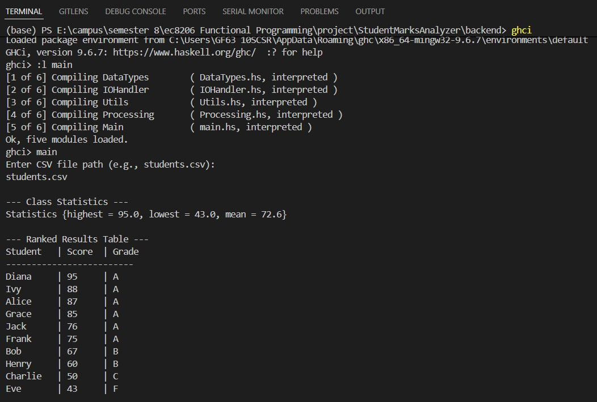

# Student Marks Analyzer

## Group Members

- 4067 Mallikarachchi N.K.
- 4068 Manchanayake M.M.T.S.
- 4070 Manjula D.S.
- 4086 Naulla N.D.P.A.

## Description

This project builds a simple Haskell program that reads student marks from a CSV file and automatically calculates totals, averages, grades, and student rankings. It demonstrates how functional programming enables accurate, reliable, and maintainable data processing for real-world academic evaluation systems.

## How to Run

1. Open terminal in the project folder.
2. Run:
   ```bash
   cd backend
   ghci
   :load Main.hs
   main
   ```
   enter the csv file path

## Sample input/output



## Functional Programming Concepts Used

- Pure functions (`averageOf`, `gradeFromAverage`)
- Recursion (`wordsWhen`)
- Higher-order functions (`map`, `sortOn`)
- ADTs (`Student`, `Result`)
- Immutability and composition
